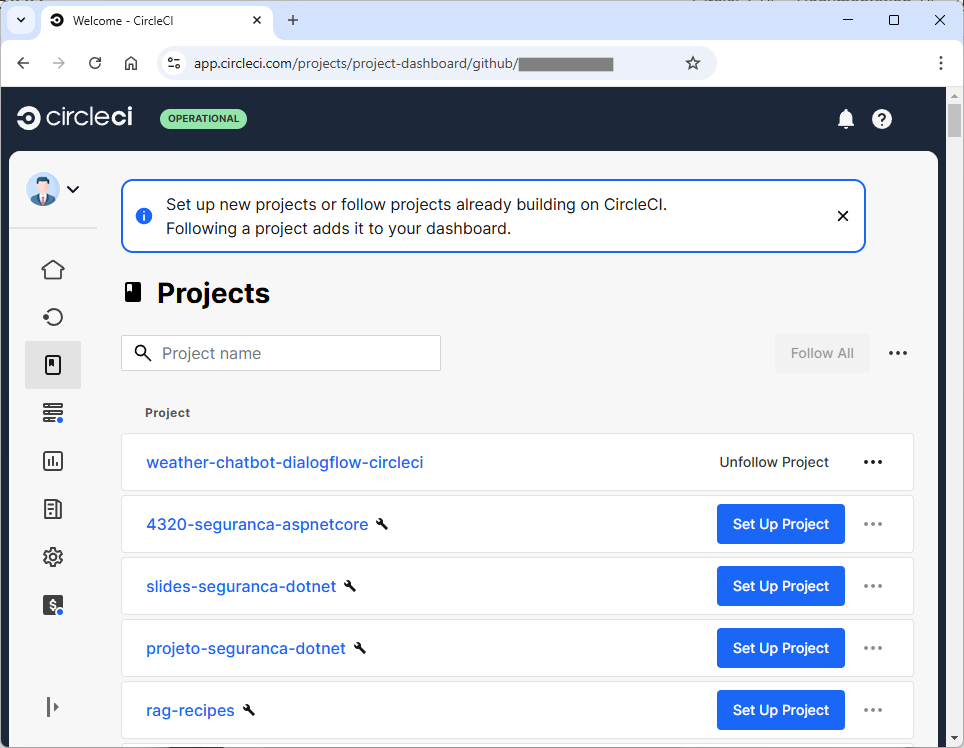
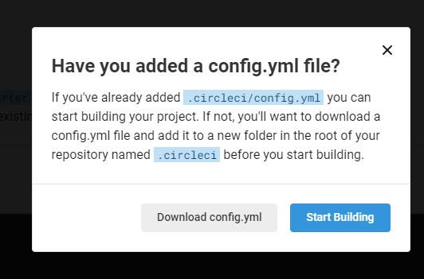
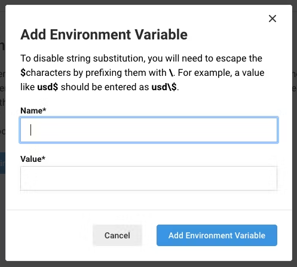
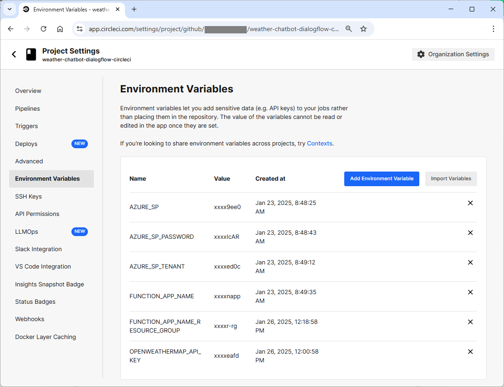
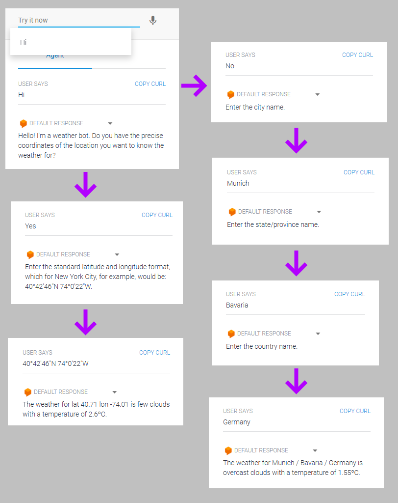

# Title: Building a Chatbot with Dialogflow And CircleCI

Here we'll guide users on building a conversational chatbot app and deploying it to Azure Function app written in Python. The chatbot app will interact with using Google Dialogflow and [OpenWeather API](https://openweathermap.org) to answer user questions related to current weather data in specific world location. Topics to be covered: designing conversation flows, integrating with external APIs, and use CircleCI to set up a CI/CD pipeline for continuous integration and deployment of chatbot updates. We'll use CircleCI to deploy our code to Azure Function app every time our GitHub repo is updated. In the end, users will be able to pass questions to Azure Function app and receive weather prediction answers produced by the chatbot.

### **Outline for the Tutorial: Building a Chatbot with Dialogflow and CircleCI**

---

## **Introduction (200 words)**  
- **Purpose of the tutorial**: Guide users in building a weather-related conversational chatbot app using Python, deploying it to Azure Function Apps, and managing updates with CircleCI.  
- **Key components involved**:  
  - **Dialogflow**: Designing conversation flows and natural language understanding.  
  - **OpenWeatherMap API**: Fetching real-time weather data.  
  - **CircleCI**: Automating CI/CD for streamlined updates.  
- **Expected outcomes**: By the end, users will have a fully functional chatbot capable of answering weather-related questions in specific locations and continuously updated through a robust deployment pipeline.  

---

## **Prerequisites (100 words)**  
- **Knowledge prerequisites**:  
  - Basic Python programming.  
  - Familiarity with REST APIs.  
  - Understanding of CI/CD principles.  
- **Tools and accounts required**:  
  - Python 3.8+ installed locally.  
  - Azure account with Function App setup.  
  - Dialogflow account for chatbot development.  
  - OpenWeatherMap API key.  
  - GitHub account and basic repository knowledge.  
  - CircleCI account connected to GitHub.  

---

## **Body (1000 words)**  

### **1. Designing the Chatbot with Dialogflow**  
- **Overview of Dialogflow**:  
  - Key components: intents, entities, and fulfillment.  
- **Creating the Dialogflow agent**:  
  - Step-by-step process: agent creation, configuring intents, and defining user utterances.  
- **Customizing responses**:  
  - Static vs. dynamic responses using fulfillment.

#### agent creation

Let's create an agent named WeatherBot...

#### configuring intents

Let's create the intents inside the WeatherBot agent, by following the steps belows:

---

### **Step 1: Set Up the Dialogflow Project**
1. Log in to the [Dialogflow Console](https://dialogflow.cloud.google.com/).
2. Open or create the project where you will create the intents.

---

### **Step 2: Create Intents**
#### **1. Create the `Greeting` Intent**
1. Navigate to **Intents** in the left menu.
2. Click **+ Create Intent** and name it `Greeting`.
3. **Training Phrases**:
   - Add the greeting phrases: "Hi" and "Hello".
4. **Responses**:
   - Add the Text Response: `"Hello! I'm a weather bot. Do you have the precise coordinates of the location you want to know the weather for?"`.
5. Save the intent.

---

#### **2. Create the `Yes_Coordinates Flow` Intent**
1. In the /intents page of your agent in DialogFlow, move the mouse over the Greeting intent and click the **Add follow-up intent** link, then choose the **yes** option.
2. Open the created intent and rename it as `Yes/Coordinates Flow`.
3. **Responses**:
   - Add responses such as `"Enter the standard latitude and longitude format, which for New York City, for example, would be: 40°42′46″N 74°0′22″W."`.
4. Save the intent.

---

#### **3. Create the `GetWeatherByCoordinates` Intent**
1. In the /intents page of your agent in DialogFlow, move the mouse over the "Yes/Coordinates Flow" intent and click the **Add follow-up intent** link, then choose the **custom** option.
2. Open the created intent and rename it as `GetWeatherByCoordinates`.
3. **Responses**:
   - Check the "Set this intent as end of conversation" option.
4. **Fullfilment**:
   - Set the Enable webhook call for this intent as `true`.
5. Save the intent.

---

#### **4. Create the `No/City Flow` Intent**
1. In the /intents page of your agent in DialogFlow, move the mouse over the Greeting intent and click the **Add follow-up intent** link, then choose the **no** option.
2. Open the created intent and rename it as `No/City Flow`.
3. **Responses**:
   - Add the Text Response: `"Enter the city name."`.
4. Save the intent.

---

#### **5. Create the `GetCityName` Intent**
1. In the /intents page of your agent in DialogFlow, move the mouse over the "No/City Flow" intent and click the **Add follow-up intent** link, then choose the **custom** option.
2. Open the created intent and rename it as `GetCityName`.
3. **Training Phrases**:
   - Add the training phrases: "New York" and "Tokyo".
4. **Parameters**:
   - Make sure the parameter below has been created by the training phrases:
     - **Name:** `geo-city`, **Entity:** `@sys.geo-city`, **Required:** Yes.
6. **Responses**:
   - Add the Text Response: `"Enter the state/province name."`.
7. Save the intent.

---

#### **6. Create the `GetStateName` Intent**
1. In the /intents page of your agent in DialogFlow, move the mouse over the "GetCityName" intent and click the **Add follow-up intent** link, then choose the **custom** option.
2. Open the created intent and rename it as `GetStateName`.
3. **Training Phrases**:
   - Add the training phrases: "California" and "Chihuahua".
4. **Parameters**:
   - Make sure the parameter below has been created by the training phrases:
     - **Name:** `geo-state`, **Entity:** `@sys.geo-state`, **Required:** Yes.
5. **Responses**:
   - Add Text Response: `"Enter the country name."`.
6. Save the intent.

---

#### **7. Create the `GetCountryName` Intent**
1. In the /intents page of your agent in DialogFlow, move the mouse over the "GetStateName" intent and click the **Add follow-up intent** link, then choose the **custom** option.
2. Open the created intent and rename it as `GetCountryName`.
3. **Parameters**:
   - Make sure the parameter below has been created by the training phrases:
     - **Name:** `geo-country`, **Entity:** `@sys.geo-country`, **Required:** Yes.
4. **Responses**:
   - Check the "Set this intent as end of conversation" option.
5. **Fullfilment**:
   - Set the Enable webhook call for this intent as `true`.
6. Save the intent.

---

### **Step 5: Deploy**
1. Integrate the bot with a platform (e.g., a website or messaging app).
2. Monitor interactions and fine-tune as needed.

This step-by-step guide ensures the flow aligns with the sequence provided.

### **2. Integrating with the OpenWeatherMap API**  
- **Setting up OpenWeatherMap**:  
  - Obtaining the API key.  
  - Understanding API documentation and query parameters.  
- **Writing Python scripts for API integration**:  
  - Fetching current weather data for user-specified locations.  
  - Formatting and error handling for API responses.  

### Configuring an Azure Function App: Step-by-Step

Setting up an Azure Function App involves several key steps to prepare the environment, authenticate with Azure, and deploy the necessary resources. The following commands use the Azure Command-Line Interface (CLI).

The first step in any Azure operation is to authenticate with your Azure account:

```bash
az login --tenant [YOUR-AZURE-TENANT]
```

Next, you need to create a resource group to hold the Azure resources related to our project.

```bash
az group create --name [YOUR-AZURE-RESOURCE-GROUP] --location [YOUR-AZURE-REGION]
```

Then we create a Service Principal (SP) to allow our CircleCI project to authenticate with Azure and perform operations:

```bash
az ad sp create-for-rbac --name circleci-weather-sp --role Contributor --scopes /subscriptions/[YOUR-AZURE-SUBSCRIPTION]/resourceGroups/[YOUR-AZURE-RESOURCE-GROUP]
```

Next, create a new Azure Storage account to manage logs, queues, and other function-related data:

```bash
az storage account create --name circleciweatherstorage --location [YOUR-AZURE-REGION] --resource-group [YOUR-AZURE-RESOURCE-GROUP] --sku Standard_LRS
```

Finally, create the Azure Function App itself, which will host the Python-based function that you want to deploy:

```bash
az functionapp create --resource-group [YOUR-AZURE-RESOURCE-GROUP] --consumption-plan-location [YOUR-AZURE-REGION] --runtime python --runtime-version "3.11" --functions-version 4 --name circleci-weather-functionapp --os-type linux --storage-account circleciweatherstorage
```


### **3. Setting up the Azure Function App**  

The provided Python code implements an Azure Function webhook that communicates with Dialogflow intents to provide weather information using the OpenWeatherMap API. Below are the key highlights and how the code communicates with Dialogflow intents:

1. **Environment Variables**:
   - The `OPENWEATHERMAP_API_KEY` is loaded from an `.env` file using the `dotenv` package. This key is used for making API requests to OpenWeatherMap. If you want to run this Azure Function App locally, create a `local.settings.json` file with this content:

```json
   {
    "IsEncrypted": false,
        "Values": {
            "AzureWebJobsStorage": "UseDevelopmentStorage=true",
            "FUNCTIONS_WORKER_RUNTIME": "python",
            "AzureWebJobsFeatureFlags": "EnableWorkerIndexing",
            "OPENWEATHERMAP_API_KEY": "[YOUR-OPENWEATHERMAP-API-KEY]"
        }
    }

```
3. **Azure Function Webhook**:
   - The Azure Function is defined with an HTTP route (`/webhook`) that listens for incoming HTTP requests.
   - **Intent Handling**: The code processes incoming requests from Dialogflow based on the detected intent:
     - **"GetWeatherByCoordinates"**: The function extracts latitude and longitude from the `queryText`, parses it using the `parse_lat_lon()` helper, and fetches the weather data using those coordinates.
     - **"GetCountryName"**: The function extracts `geo-city`, `geo-state`, and `geo-country` from the `outputContexts` in the Dialogflow request, uses the `get_coords()` function to fetch latitude and longitude, and then retrieves weather data for that location.
     - If the intent is not recognized or is unhandled, the function returns a default message.
   
4. **Error Handling**:
   - If the latitude and longitude cannot be parsed, or if there is an error in fetching the weather data, appropriate responses are returned (e.g., "Invalid latitude and longitude format" or "Failed to fetch weather data").
   - General errors are caught and logged, returning a generic error message in case of unexpected issues.

### **Communication with DialogFlow Intents**:

The Azure Function webhook interacts with Dialogflow intents in the following ways:

1. **Incoming Request Structure**:
   - The webhook expects incoming HTTP requests to contain a JSON payload with `queryResult`, which contains the `intent` name and relevant parameters.
   - The relevant parameters, like `geo-city`, `geo-state`, and `geo-country`, are extracted from the `outputContexts` (for intents like `GetCountryName`).
   
2. **Handling the `GetWeatherByCoordinates` Intent**:
   - The webhook listens for the `GetWeatherByCoordinates` intent.
   - It extracts the `queryText` from the incoming request and attempts to parse latitude and longitude from it using the `parse_lat_lon()` function.
   - If the coordinates are valid, it makes a request to OpenWeatherMap's weather API using the parsed coordinates and returns the weather details to the user in the response.

3. **Handling the `GetCountryName` Intent**:
   - The webhook listens for the `GetCountryName` intent.
   - It extracts the city, state, and country from the `outputContexts` of the incoming request.
   - The webhook then makes a request to OpenWeatherMap's geo API to retrieve the latitude and longitude of the location based on the extracted city, state, and country.
   - The coordinates are used to call the weather API and return the weather data to the user.

4. **Response Format**:
   - For both intents, the webhook returns a JSON response with the `fulfillmentText` field, which contains the weather details (e.g., weather description and temperature).
   - If there are errors (e.g., invalid input or failed API request), the function responds with appropriate error messages.

### **How It Communicates with DialogFlow Intents**:

1. **Dialogflow** sends a JSON payload to the Azure Function webhook, which contains the `intent` and extracted parameters (`geo-city`, `geo-state`, `geo-country`, `queryText`).
2. The Azure Function processes this information, calling the appropriate weather APIs and formatting the response.
3. The Azure Function returns the weather information in the `fulfillmentText` field of the JSON response, which Dialogflow uses to respond to the user.

## Configuring the Project on CircleCI

In this step, we will automate the deployment process. Begin by [pushing the project to GitHub](https://circleci.com/blog/pushing-a-project-to-github/) from the root of your project folder.

Next, visit the Projects page on the [CircleCI dashboard](https://app.circleci.com/projects). Select the appropriate GitHub account to link the project.



### Add Project to CircleCI

Click on the **Set Up Project** button to initiate the project setup.

### Configure CircleCI

On the setup page, select **Use Existing Config** to indicate that you're adding a configuration file manually, instead of using the sample provided. You'll then be prompted to either download the configuration file for the pipeline or start the build.



### Start the Build

Click **Start Building**. The initial build will fail because the configuration file hasn't been set up yet, but we will complete this step later in the tutorial.

At this point, you'll need access to your Azure account in the deployment script. This is why we created the Azure Service Principal account earlier in the tutorial. We will use the [azure-cli](https://circleci.com/developer/orbs/orb/circleci/azure-cli) orb to log in and use Azure CLI in the deployment script. This orb requires the setup of several environment variables for the project.

The required environment variables are:

- **AZURE_SP**: The appId of your Service Principal
- **AZURE_SP_PASSWORD**: The password key from your service principal account creation response
- **AZURE_SP_TENANT**: The tenant key from your service principal account creation response
- **FUNCTION_APP_NAME**: The name of your Azure Function App created with the Azure CLI
- **FUNCTION_APP_NAME_RESOURCE_GROUP**: The name of the Azure resource group where the function app was created
- **OPENWEATHERMAP_API_KEY**: The API key obtained when you registered with OpenWeather

Go to **Project Settings** and then **Environment Variables** on your CircleCI project, and click **Add Environment Variable**.



Using the dialog, add the environment variables listed above.



### **3. Configuring CircleCI Integration**  

Let's discuss the following config.yml file contained in the /.circleci folder of our Azure Function App project.

```yaml
jobs:
  deploy:
    working_directory: ~/repo
    docker:
      - image: cimg/python:3.9
    steps:
      - checkout
      - azure-cli/install
      - azure-cli/login-with-service-principal
      - run:
          name: Install Azure Functions Core Tools
          command: |
            curl https://packages.microsoft.com/keys/microsoft.asc | gpg --dearmor > microsoft.gpg
            sudo mv microsoft.gpg /etc/apt/trusted.gpg.d/
            sudo sh -c 'echo "deb [arch=amd64] https://packages.microsoft.com/repos/microsoft-ubuntu-$(lsb_release -cs)-prod $(lsb_release -cs) main" > /etc/apt/sources.list.d/dotnetdev.list'
            sudo apt-get update
            sudo apt-get install azure-functions-core-tools-4
      - run:
          name: Deploy to Azure Function App
          command: |
            CLI_DEBUG=1 func azure functionapp publish $FUNCTION_APP_NAME --python
            az functionapp config appsettings set --name $FUNCTION_APP_NAME --resource-group $FUNCTION_APP_NAME_RESOURCE_GROUP --settings OPENWEATHERMAP_API_KEY=$OPENWEATHERMAP_API_KEY

orbs:
  azure-cli: circleci/azure-cli@1.0.0
  python: circleci/python@1.2.0
version: 2.1
workflows:
  login-workflow:
    jobs:
      - deploy

```

This CircleCI configuration automates the process of deploying a Python app to Azure Functions. It installs necessary tools like Azure Functions Core Tools, logs in to Azure, and then deploys the app to an Azure Function App. Additionally, it sets an environment variable (`OPENWEATHERMAP_API_KEY`) needed for the app's functionality. The configuration uses reusable orbs for Azure CLI and Python-related steps, simplifying the deployment process.

### **3. Deploying the Chatbot to Azure Function App**  
- **Setting up Azure Function App**:  
  - Configuring a Python Function App.  
  - Understanding function triggers for HTTP-based interactions.  
- **Deploying the chatbot code**:  
  - Packaging Python dependencies using `requirements.txt`.  
  - Testing deployment with Azure Function App’s tools.  

### **4. Setting Up CI/CD with CircleCI**  
- **Overview of CircleCI and its role in deployment**.  
- **Configuring CircleCI for the project**:  
  - Creating the `config.yml` file.  
  - Setting up build, test, and deploy workflows.  

- **Connecting CircleCI to GitHub and Azure**:  
  - Setting up GitHub triggers for CircleCI.  
  - Configuring Azure credentials in CircleCI for deployment.  

- When setting up the CI pipeline, be sure to walk through the config, explaining what's happening in different jobs and steps. Assume the reader might not know much (or anything) about CI/CD. Showcase the value and provide a practical demonstration of the setup.
- No hard sell, just walk folks through what's happening and why it's beneficial as they probably aren't familiar, and we want to give them reason to sign up for free.

### **5. Testing and Validating the Chatbot**  
- **Testing conversation flows in Dialogflow**:  
  - Using the built-in simulator.  
- **Testing API integrations**:  
  - Debugging responses from OpenWeatherMap.  
- **Validating the deployment pipeline**:  
  - Triggering a sample deployment via CircleCI. End by demonstrating a simple update to the app that triggers the pipeline. Bonus points if you can show the pipeline catching an error, then making a quick fix and the pipeline building green. 

### **Step 3: Test the Coordinates Flow**
1. Use the **Try it now** panel in the Dialogflow console.
2. Type in 'Hi' in the **Try it now** field.
3. DialogFlow will respond with "Hello! I'm a weather bot. Do you have the precise coordinates of the location you want to know the weather for?"
4. Type in 'Yes' in the **Try it now** field.
5. DialogFlow will respond with "Enter the standard latitude and longitude format, which for New York City, for example, would be: 40°42′46″N 74°0′22″W."
6. Type in '40°42′46″N 74°0′22″W' in the **Try it now** field.
7. DialogFlow will respond with something like "The weather for lat 40.71 lon -74.01 is few clouds with a temperature of 5.68ºC.".

---

### **Step 4: Test the City Name Flow**
1. Use the **Try it now** panel in the Dialogflow console.
2. Type in 'Hi' in the **Try it now** field.
3. DialogFlow will respond with "Hello! I'm a weather bot. Do you have the precise coordinates of the location you want to know the weather for?"
4. Type in 'No' in the **Try it now** field.
5. DialogFlow will respond with "Enter the city name."
6. Type in 'Munich' in the **Try it now** field.
7. DialogFlow will respond with "Enter the state/province name."
8. Type in 'Bavaria' in the **Try it now** field.
9. DialogFlow will respond with "Enter the country name."
10. Type in 'Germany' in the **Try it now** field.
11. DialogFlow will respond with "The weather for Munich / Bavaria / Germany is overcast clouds with a temperature of 1.94ºC."

You'll end up with two flows that can respond to user questions about the current weather either using latitude and longitude or the city, state, and country names:



---

## **Conclusion (300 words)**  
- **Summary of the process**:  
  - Designed a weather chatbot with Dialogflow.  
  - Integrated OpenWeatherMap for real-time data.  
  - Deployed the chatbot to Azure Functions using CircleCI for CI/CD.
  - Set up the Azure Function app so that users receive weather prediction answers produced by the chatbot.
- **Key takeaways**:  
  - Combining cloud services like Azure and Dialogflow enables scalable chatbot applications.  
  - CI/CD with CircleCI ensures continuous updates and smooth deployment.  
- **Future possibilities**:  
  - Enhancing chatbot capabilities with more APIs (e.g., location-based services).  
  - Using advanced AI features in Dialogflow or Azure Cognitive Services.  
- **Encouragement for exploration**: Links to official documentation for Azure Functions, Dialogflow, OpenWeatherMap, and CircleCI for further learning.  
